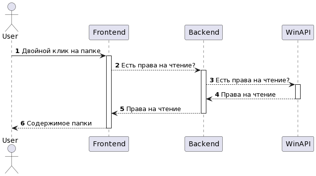
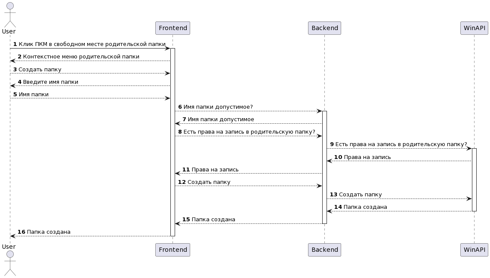
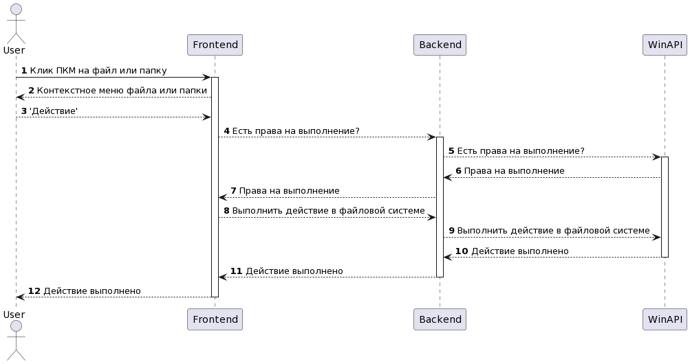
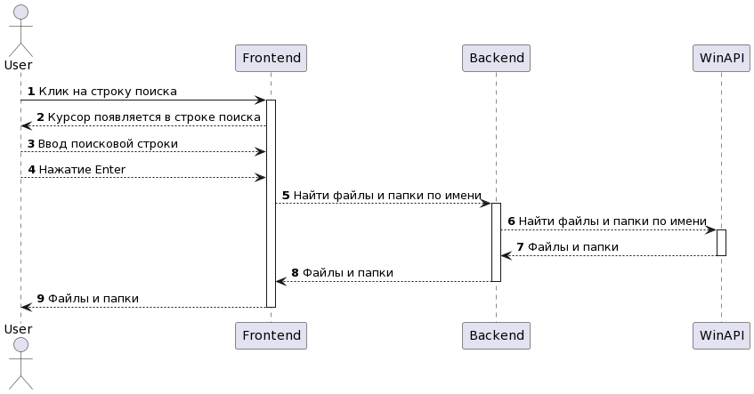
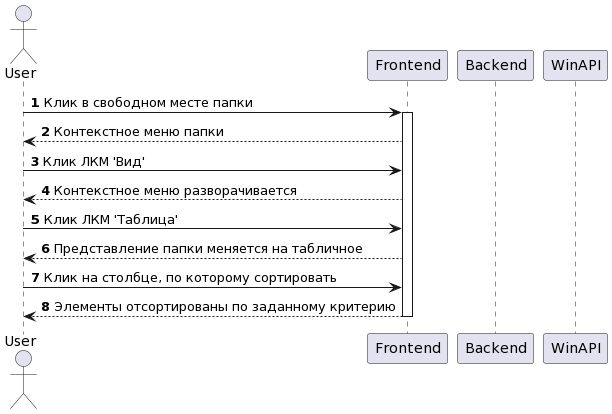
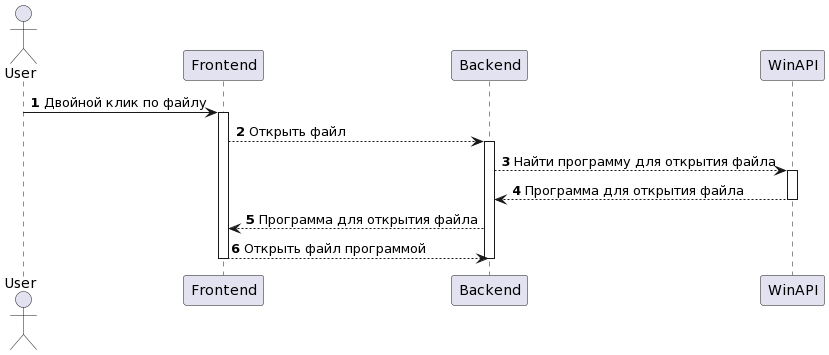

# Диаграммы последовательности
---

# Содержание
1. [Просмотр содержимого папки](#1)
2. [Создание новой папки](#2)
3. [Копирование, перемещение и удаление файлов и папок](#3)
4. [Поиск файлов и папок](#4)
5. [Сортировка файлов и папок](#5)
6. [Открытие файлов в ассоциированных ОС программах](#6)

### 1. Просмотр содержимого папки

### 2. Создание новой папки

### 3. Копирование, перемещение и удаление файлов и папок

### 4. Поиск файлов и папок

### 5. Сортировка файлов и папок

### 6. Открытие файлов в ассоциированных ОС программах

