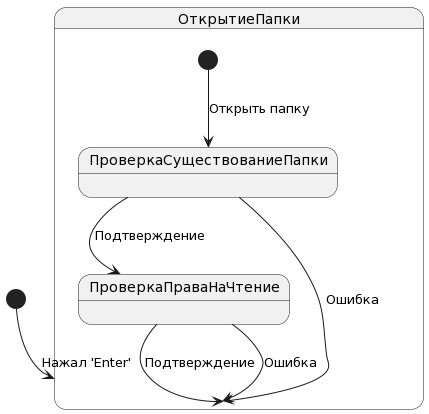
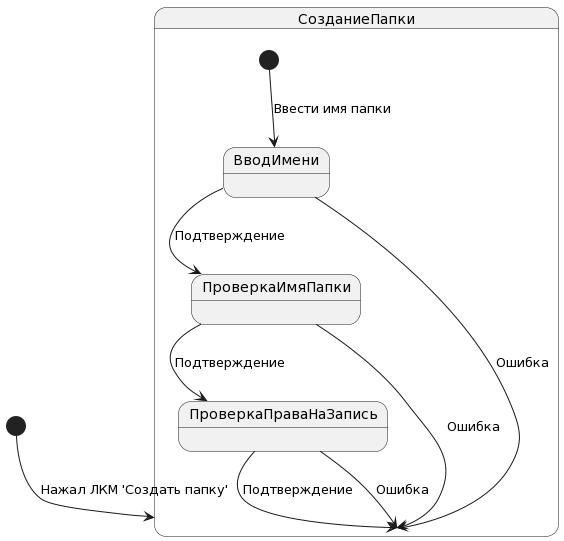
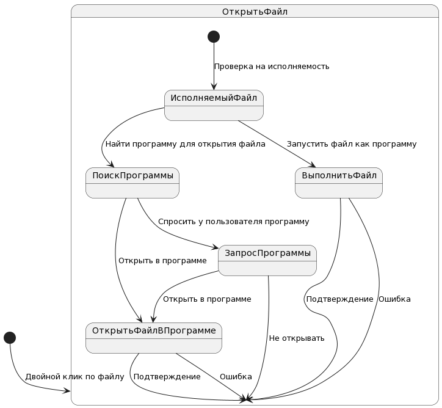

# Диаграммы состояний
---

# Содержание
1. [Просмотр содержимого папки](#1)
2. [Создание новой папки](#2)
3. [Открытие файлов в ассоциированных ОС программах](#3)

### 1. Просмотр содержимого папки

### 2. Создание новой папки

### 3. Открытие файлов в ассоциированных ОС программах

