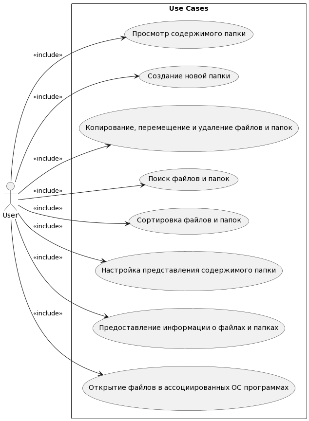

# Диаграмма вариантов использования

---

## Варианты использования

---

## 2.1 Просмотр содержимого папки

**Описание:** Вариант использования "Просмотр содержимого папки" позволяет пользователю увидеть содержимое каталога файловой системы в окне программы.

**Предусловия:** Пользователь указал правильный путь к папке или выбрал её в графическом интерфейсе, и у программы есть права на её чтение.

**Основной поток:**
1. Пользователь выбирает папку в графическом интерфейсе или вводит путь к ней в систему.
2. Система проверяет правильность пути и права на чтение папки.
3. Если путь к папке неверный или нет прав на её чтение, пользователь получает сообщение об ошибке.
4. Система отображает содержимое папки в текущей вкладке.

## 2.2 Создание новой папки

**Описание:** Вариант использования "Создание новой папки" позволяет пользователю создать новый каталог файловой системы.

**Предусловия:** Пользователь открыл родительскую папку в графическом интерфейсе программы, и у программы есть права на её чтение и запись в неё.

**Основной поток:**
1. Пользователь выбирает опцию "Создать папку" в контекстном меню.
2. Пользователь вводит имя папки.
3. Система проверяет права на запись в родительский каталог, и если они имеются, создает папку.

## 2.3 Копирование, перемещение и удаление файлов и папок

**Описание:** Вариант использования "Копирование, перемещение и удаление файлов и папок" позволяет пользователю проводить манипуляции с объектами файловой системы.

**Предусловия:** Пользователь имеет необходимые права на запрашиваемые изменения в файловой системе.

**Основной поток:**
1. Пользователь выбирает файл или папку в графическом интерфейсе программы.
2. Пользователь открывает контекстное меню и выбирает действие с объектом.
3. Система проверяет наличие прав у пользователя на выполнение запрошенного действия.
4. Если права имеются, система вносит изменения в файловую систему.

## 2.4 Поиск файлов и папок

**Описание:** Вариант использования "Поиск файлов и папок" позволяет пользователю фильтровать содержимое папки по частичному имени.

**Предусловия:** Пользователь открыл родительскую папку в графическом интерфейсе программы.

**Основной поток:**
1. Пользователь вводит частичное имя в строку поиска и нажимает Enter.
2. Система начинает рекурсивный поиск в папке.
3. Найденные объекты файловой системы выводятся в окне отображения содержимого папок.
 

## 2.5 Сортировка файлов и папок

**Описание:** Вариант использования "Сортировка файлов и папок" позволяет пользователю сортировать содержимое папки по следующим критериям: имя, дата изменения, тип файла, размер файла.

**Предусловия:** Пользователь открыл родительскую папку в графическом интерфейсе программы.

**Основной поток:**
1. Пользователь выбирает режим отображения "Таблица".
2. Пользователь кликает на заголовок столбца, по которому будет происходить сортировка.
3. Система сортирует элементы в папке по выбранному критерию.

## 2.6 Настройка представления содержимого папки

**Описание:** Вариант использования "Настройка представления содержимого папки" позволяет пользователю выбрать режим отображения содержимого папки.

**Предусловия:** Пользователь открыл родительскую папку в графическом интерфейсе программы.

**Основной поток:**
1. Пользователь выбирает режим отображения и вид элементов файловой системы в контекстном меню.
2. Система перерисовывает содержимое папки в соответствии с выбором пользователя.

## 2.7 Предоставление информации о файлах и папках

**Описание:** Вариант использования "Предоставление информации о файлах и папках" позволяет пользователю получить информацию об объектах файловой системы.

**Предусловия:** Пользователь открыл родительскую папку в графическом интерфейсе программы, пользователь имеет права на чтение файла или папки.

**Основной поток:**
1. Пользователь выбирает файл или папку одним кликом.
2. Информация выводится в правом окне программы.

## 2.8 Открытие файлов в ассоциированных ОС программах

**Описание:** Вариант использования "Открытие файлов в ассоциированных ОС программах" позволяет пользователю открыть файл в программе, ассоциация типа файла с которой установлена в ОС.

**Предусловия:** Пользователь открыл родительскую папку в графическом интерфейсе программы, пользователь имеет права на чтение открываемого файла.

**Основной поток:**
1. Пользователь делает двойной клик по файлу.
2. Система ищет нужную программу по типу файла.
3. Если программа найдена, система запускает её и передает путь файла для открытия.
4. Если программа не найдена, система предлагает пользователю самостоятельно выбрать программу.