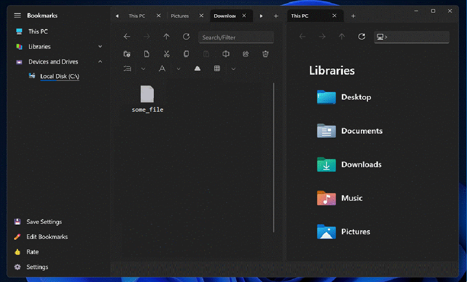
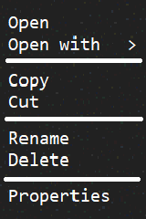

# FileManager

* 1 [Введение](#1-введение)
* 2 [Требования пользователя](#2-требования-пользователя)
    * 2.1 [Программные интерфейсы](#21-программные-интерфейсы)
    * 2.2 [Интерфейс пользователя](#22-интерфейс-пользователя)
    * 2.3 [Характеристики пользователей](#23-характеристики-пользователей)
    * 2.4 [Предположения и зависимости](#24-предположения-и-зависимости)
* 3 [Системные требования](#3-системные-требования)
    * 3.1 [Функциональные требования](#31-функциональные-требования)
    * 3.2 [Нефункциональные требования](#32-нефункциональные-требования)
    * 3.3 [Атрибуты качества](#33-атрибуты-качества)

## 1. Введение

FileManager - это программа для управления файлами и папками на компьютере. Она позволяет пользователям просматривать содержимое дисков, создавать новые папки, копировать, перемещать и удалять файлы, а также выполнять другие операции с файлами и каталогами. Она имеет простой и интуитивно понятный интерфейс, который позволяет пользователям быстро и легко находить нужные файлы и работать с ними.

## 2. Требования пользователя

### 2.1 Программные интерфейсы

FileManager пишется на C# для ОС Windows и использует следующие программные интерфейсы для работы с файловой системой:

- **.NET Framework** это основная программная платформа для разработки приложений на C#. Она предоставляет набор классов и интерфейсов для работы с различными аспектами операционной системы, включая файловую систему.
- **Windows API (Win32)** это низкоуровневый программный интерфейс, предоставляемый операционной системой Windows, который позволяет программам взаимодействовать с операционной системой и ее компонентами. Файловый проводник использует Win32 API для выполнения операций с файлами, такими как чтение, запись и удаление файлов.

### 2.2 Интерфейс пользователя

Пользовательский интерфейс FileManager состоит из следующих элементов:

- **Главное меню** находится в верхней части экрана и содержит список команд и функций, доступных в программе.
- **Панель инструментов** расположена под главным меню и содержит кнопки для выполнения основных операций с файлами и папками, таких как создание, копирование, перемещение, удаление и т. д.
- **Панель быстрого доступа** позволяет быстро получать доступ к часто используемым файлам.
- **Рабочая область** занимает основную часть экрана и отображает содержимое текущей папки в виде значков или списка.
- **Строка состояния** находится внизу рабочей области и отображает информацию о текущем состоянии файлового менеджера, такую как путь к текущей папке, количество выбранных файлов и т. п.
- **Строка поиска** позволяет искать файлы/папки по определенным критериям.

Окно файлового менеджера:

Контекстное меню файлового менеджера:

### 2.3 Характеристики пользователей

Пользователи файлового проводника могут иметь совершенно различный опыт/техническую грамотность, и их уровень доступа зависит от прав, установленных в файловой системе, и прав учетной записи ПК, род которой они вошли в систему. Права могут быть установлены на различные операции с файлами и папками, такие как чтение, запись, удаление, изменение прав доступа и т.д. В зависимости от установленных прав, пользователи могут иметь полный доступ ко всем файлам и папкам или ограниченный доступ только к определенным файлам и папкам.

### 2.4 Предложения и зависимости

Следующие факторы могут повлиять на системные требования:

- **Уровень пользователя** - требования к системе могут быть разными для разных уровней пользователей. Например, для начинающих пользователей может потребоваться более простой и понятный интерфейс, в то время как для опытных пользователей могут быть нужны более сложные функции.
- **Требования к безопасности** - система может иметь определенные требования к безопасности, такие как защита от вирусов и вредоносного ПО или шифрование данных.
- **Требования к локализации** - система может требовать поддержки различных языков и культур, в зависимости от географического региона или языка пользователя.

## 3. Системные требования

- ОС Windows 7+
- .NET 3.5+

### 3.1 Функциональные требования

- Возможность просмотра содержимого папок.
- Создание новых папок.
- Копирование, перемещение и удаление файлов.
- Поиск файлов и папок.
- Работа с различными форматами файлов.
- Поддержка Drag and Drop.
- Настройка интерфейса.
- Управление правами доступа к файлам и папкам.
- Шифрование и дешифрование файлов.
- Интеграция с другими приложениями.
- Возможность сортировки файлов по различным параметрам (имя, размер, дата изменения и т.д.).
- Поддержка Unicode.
- Интуитивно понятный и удобный интерфейс.
- Возможность масштабирования интерфейса.

### 3.2 Нефункциональные требования

Для реализации проекта необходимо использовать язык программирования C# и фреймворк .NET Framework 3.5 (выбор версии обусловлен ее наличием на ОС Windows 7 по умолчанию).

### 3.3 Атрибуты качества

Приложение должно обладать хорошей производительностью и быстро запускаться на компьютере.
